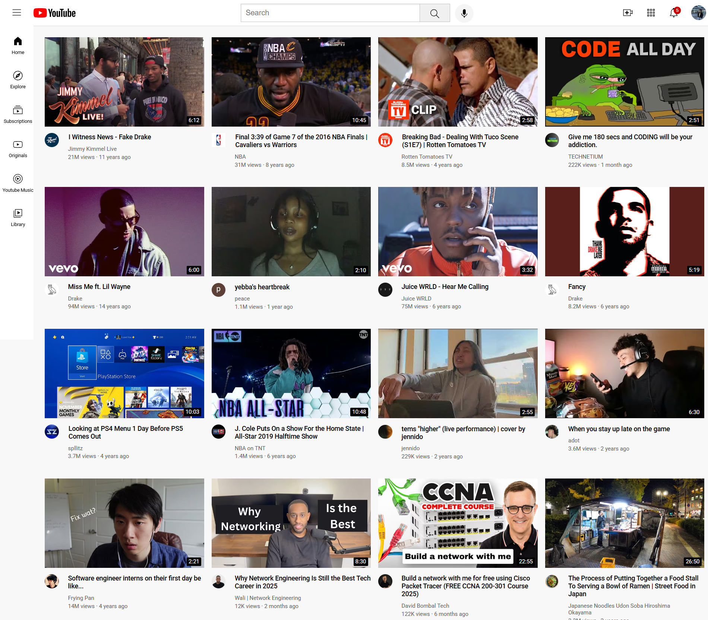

# YouTube Clone

A responsive frontend clone of the YouTube interface built exclusively with HTML5 and CSS3. This project replicates the core layout and visual design of YouTube's desktop, tablet, and mobile views without any JavaScript frameworks, backend services, or video playback functionality.

## Screenshots

### Fullscreen



### Window Screen


## Features

- Fully responsive layout across desktop, tablet, and mobile breakpoints
- Semantic HTML5 structure matching YouTube's page hierarchy
- CSS Grid and Flexbox for modern layout implementation
- Dark and light theme support via CSS custom properties
- Accessible markup with proper heading hierarchy and ARIA labels
- Pixel-perfect recreation of header, sidebar, video grid, and footer components

## Tech Stack

- HTML5
- CSS3


## Getting Started

### Prerequisites

A modern web browser (Chrome, Firefox, Safari, or Edge).

### Installation

```bash
git clone https://github.com/ctrl-jo/Youtube-Clone.git
cd Youtube-Clone
```

### Usage

Open `index.html` directly in your browser, or serve the directory with a local development server:

```bash
# Using Python 3
python -m http.server 8000

# Using Node.js (if http-server is installed)
npx http-server

# Using PHP
php -S localhost:8000
```

Then navigate to `http://localhost:8000` in your browser.

## Project Structure

```
Youtube-Clone/
├── index.html
├── channel-profile/
│   └── [16 jpg channel profile images]
├── icons/
│   ├── hamburger-menu.svg
│   ├── notifications-icon.svg
│   ├── search-logo.svg
│   ├── upload-icon.svg
│   ├── voice-search-icon.svg
│   ├── youtube-apps-icon.svg
│   ├── youtube-logo.svg
│   └── sidebar/
│       ├── explore.svg
│       ├── home.svg
│       ├── library.svg
│       ├── originals.svg
│       ├── subscriptions.svg
│       └── youtube-music.svg
├── styles/
│   ├── general.css
│   ├── header.css
│   ├── sidebar.css
│   └── youtube.css
├── thumbnail/
│   └── [16 avif video thumbnail images]
├── screenshots/
│   ├── Fullscreen.png
│   └── Window Screen.png
├── roadmap/
│   ├── phase-1-project-setup.md
│   ├── phase-2-header.md
│   ├── phase-3-sidebar.md
│   ├── phase-4-video-grid.md
│   └── phase-5-responsiveness.md
└── README.md
```

## Development Roadmap

Want to build this YouTube Clone yourself? Follow the step-by-step roadmap below. Each phase covers specific HTML and CSS concepts, includes detailed instructions, and builds on the previous one.

| Phase | Title | Key HTML Concepts | Key CSS Concepts |
|---|---|---|---|
| 1 | [Project Setup & Base Styles](roadmap/phase-1-project-setup.md) | HTML5 boilerplate, meta tags, linking stylesheets, Google Fonts, semantic elements | CSS reset, `box-sizing: border-box`, universal selector, `font-family` |
| 2 | [Building the Header](roadmap/phase-2-header.md) | `<header>`, `<input>`, `<button>`, `` for SVGs, nesting elements | Flexbox, `position: fixed`, `z-index`, hover effects, tooltips, `border-radius`, `object-fit` |
| 3 | [Building the Sidebar](roadmap/phase-3-sidebar.md) | `<nav>` element, icon + text pattern, semantic navigation | `position: fixed`, `flex-direction: column`, `calc()`, viewport units, hover states |
| 4 | [Building the Video Grid](roadmap/phase-4-video-grid.md) | `<main>`, `<section>`, `<a>` links, HTML entities, image formats (`.avif`, `.jpg`) | CSS Grid, `grid-template-columns`, `1fr` unit, `relative`/`absolute` positioning, `-webkit-line-clamp`, link styling |
| 5 | [Responsiveness & Final Polish](roadmap/phase-5-responsiveness.md) | Viewport meta tag | Media queries, breakpoints, `display: none`, `max-width`, `aspect-ratio`, responsive typography |

> **💡 Tip**: Each phase includes a checklist, code examples, visual diagrams, and explanations of *why* each technique is used — not just *how*.

## Project Status

This is a static frontend learning project. It does not include:

- Backend services or APIs
- Video playback or streaming capabilities
- User authentication or account management
- Dynamic content loading
- Real-time features (comments, live chat, notifications)

The project is complete as a visual and structural clone for educational purposes.

## Author

**Joseph Mercado**

- GitHub: [https://github.com/ctrl-jo](https://github.com/ctrl-jo)

## Acknowledgments

This project was built following the tutorial by **[SuperSimpleDev](https://www.youtube.com/@SuperSimpleDev)** on YouTube. His step-by-step teaching approach made it possible to learn HTML and CSS by building a real-world project from scratch.

If you're a beginner looking to get started with web development, I highly recommend checking out his channel for clear, beginner-friendly content.

## License

This project is licensed under the MIT License. See the [LICENSE](LICENSE) file for details.

## Disclaimer

This project is not affiliated with, endorsed by, or connected to YouTube or Google LLC in any way. All trademarks, service marks, and trade names referenced herein are the property of their respective owners. This clone was created solely for educational and portfolio purposes.